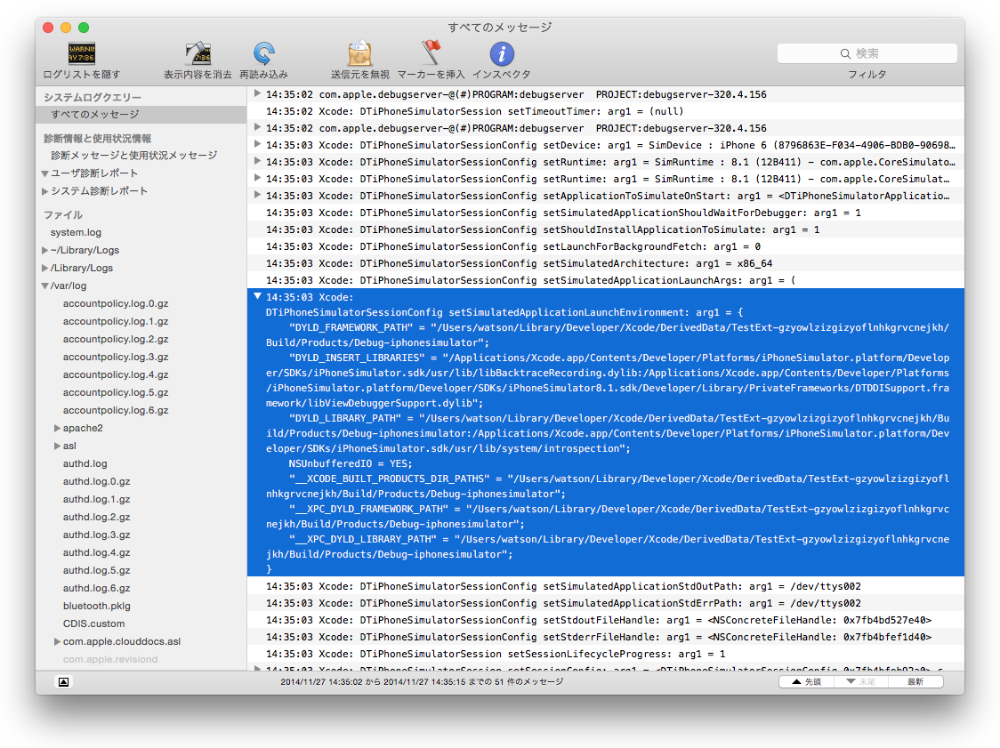

## Sniffer

This is SIMBL pluging for Xcode to snif APIs for iOS simulator

### Requirement

- EasySIMBL (https://github.com/norio-nomura/EasySIMBL)
- Xcode 6.x

### How to use

1) Build this plugin with `rake`
2) Install plugin (`build/Release/sniffer.bundle`) into EasySIMBL
3) Launch Xcode then build iOS app
4) Confirm the logs using `Console.app`

